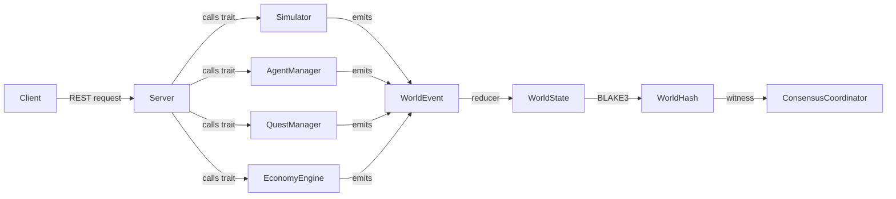
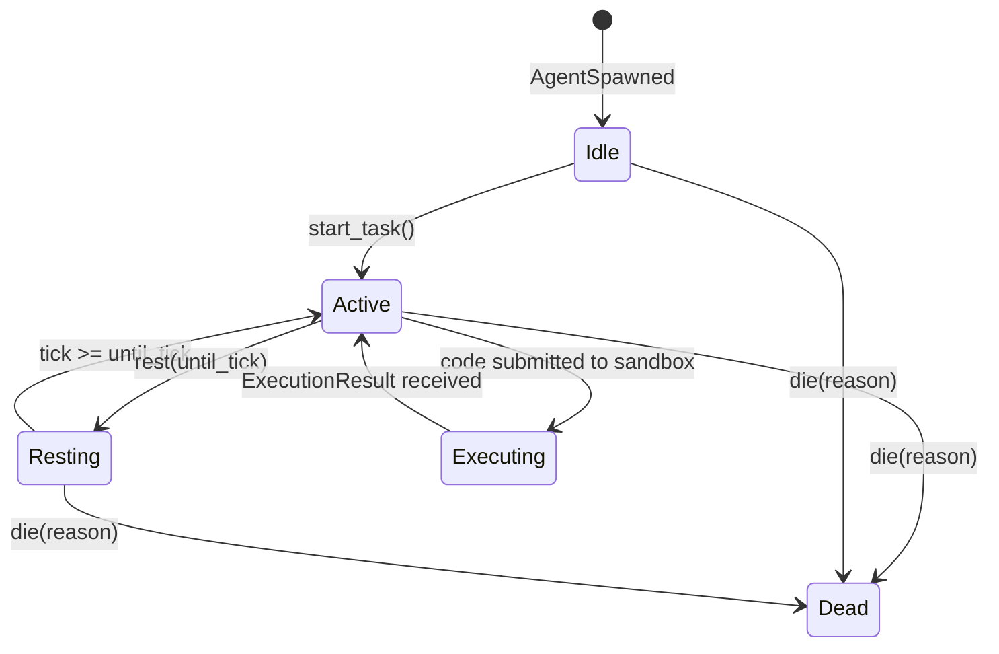
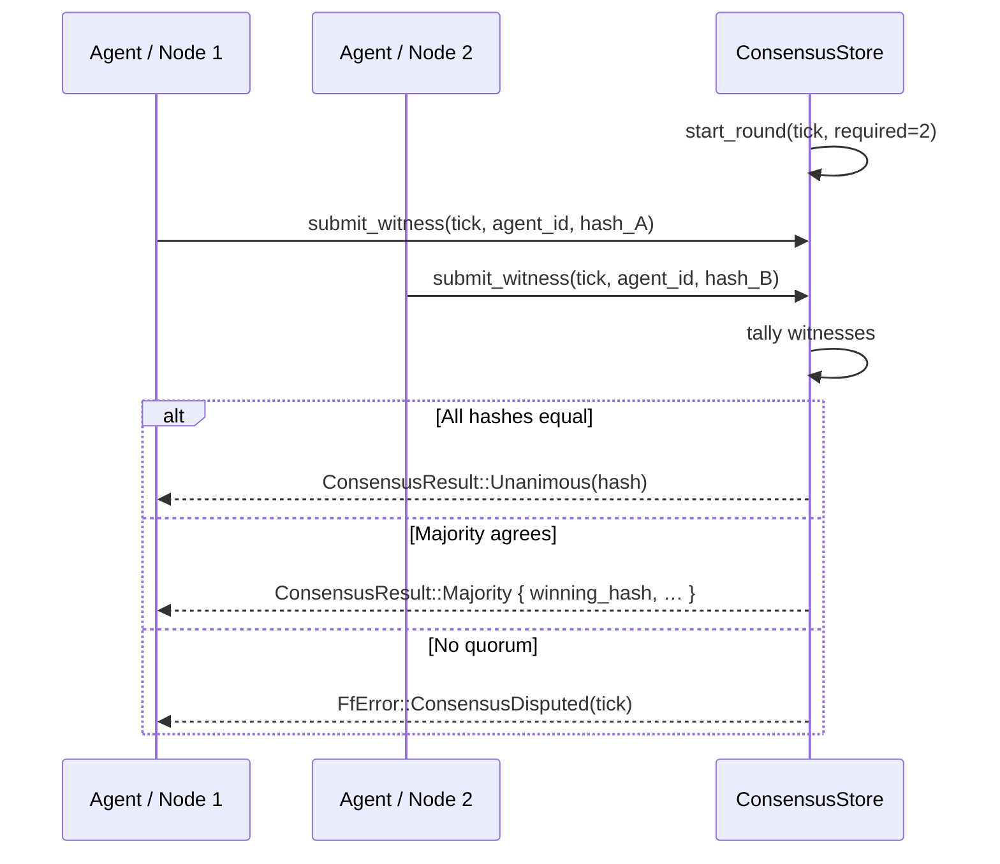

# ForgeFabrik — Architecture

This document describes the internal structure of ForgeFabrik: how the layers relate,
how events flow, and how each subsystem works. Read this before adding a new crate or trait.

---

## Table of Contents

1. [Layer Model](#layer-model)
2. [Crate Map](#crate-map)
3. [Event-First Data Flow](#event-first-data-flow)
4. [Trait-to-Implementation Map](#trait-to-implementation-map)
5. [Agent Lifecycle](#agent-lifecycle)
6. [World Simulation Pipeline](#world-simulation-pipeline)
7. [BLAKE3 Consensus Protocol](#blake3-consensus-protocol)
8. [Sandbox Security Pipeline](#sandbox-security-pipeline)
9. [Plugin System](#plugin-system)
10. [Key Invariants](#key-invariants)

---

## Layer Model

ForgeFabrik follows the BKG three-layer model. The dependency direction is one-way and
unbreakable:

```
┌─────────────────────────────────┐
│  runtime/   (I/O boundary)      │  HTTP · processes · plugins · CLI
│  ↑ depends on ↓                 │
│  domain/    (business logic)    │  deterministic · no I/O · event-driven
│  ↑ depends on ↓                 │
│  foundation/ (primitives)       │  types · traits · errors · events
└─────────────────────────────────┘
```

`plugins/` are `cdylib` crates loaded at runtime by `runtime/plugin`. They implement
domain concepts but are compiled separately and dynamically linked.

---

## Crate Map

### foundation/

| Crate | Key exports |
|---|---|
| `types` | `Agent`, `AgentState`, `AgentKind`, `FreeProvider`, `Block`, `Material`, `WorldState`, `Chunk`, `Position3D`, `Quest`, `Wallet`, `SecurityAssessment`, `ConsensusRound`, … |
| `contracts` | `FfError`, `Result<T>`, `WorldEvent`, all trait definitions |

### domain/

| Crate | Key exports | Core invariant |
|---|---|---|
| `world` | `VoxelSimulator`, `WorldGenerator`, `PhysicsEngine`, `GreedyMesher` | Same seed → same hash |
| `agents` | `AgentManager`, `AgentPool`, state-transition functions | Dead state is terminal |
| `economy` | `MarketEngine` | Wallet balance never goes negative |
| `quests` | `QuestStore` | Quest lifecycle is monotonic |
| `security` | `StaticAnalyser` | Same code → same findings |
| `consensus` | `ConsensusStore` | Same witnesses → same result |

### runtime/

| Crate | Key exports | Allowed I/O |
|---|---|---|
| `drivers` | `ClaudeDriver`, `OpenAiDriver`, `MockDriver`, `load_free_drivers()` | HTTPS to AI APIs |
| `sandbox` | `ProcessSandbox` | Spawning child processes |
| `plugin` | `PluginHostImpl`, `PluginManifest` parser | `dlopen` / `libloading` |
| `server` | `build_app`, `AppState` | TCP/HTTP via Axum |
| `cli` | `forgefabrik` binary | All of the above |

### plugins/

| Plugin | Provides capability |
|---|---|
| `plugin-agents` | `agent` — agent lifecycle management |
| `plugin-world` | `world` — voxel world simulation |
| `plugin-gm` | `game-mode` — quest generation |
| `plugin-economy` | `economy` — resource market |

---

## Event-First Data Flow

All state mutations in ForgeFabrik flow through `WorldEvent`. State is always a projection
of the event log — never a source of truth itself.



**Rules:**
- A function that changes `WorldState` must return at least one `WorldEvent`.
- `WorldEvent` variants are self-describing — no implicit context is needed to replay them.
- `TimestampedEvent` wraps events with a wall-clock time for logging only; the timestamp
  never influences game state.

### WorldEvent variants (summary)

| Category | Variants |
|---|---|
| Agent lifecycle | `AgentSpawned`, `AgentMoved`, `AgentStateChanged`, `AgentDied` |
| World mutation | `BlockPlaced`, `BlockMined`, `ChunkLoaded`, `ExplosionAt` |
| Sandbox / security | `CodeSubmitted`, `CodeExecuted`, `SecurityAssessed` |
| Quests | `QuestCreated`, `QuestAccepted`, `QuestStatusChanged` |
| Economy | `MarketListingCreated`, `MarketPurchase`, `AuctionCreated`, `AuctionBidPlaced`, `AuctionClosed` |
| Consensus | `ConsensusRoundStarted`, `ConsensusRoundFinalised` |
| Epoch | `EpochStarted`, `EpochEnded` |

---

## Trait-to-Implementation Map

Traits are defined in `foundation/contracts`. Implementations live in the layer shown below.

| Trait | Implemented by | Layer |
|---|---|---|
| `WorldSimulator` | `VoxelSimulator` | `domain/world` |
| `AgentDriver` | `ClaudeDriver`, `OpenAiDriver`, `MockDriver` + free-tier drivers (Groq, SambaNova, Ollama, OpenRouter, Cerebras) via `load_free_drivers()` | `runtime/drivers` |
| `SandboxExecutor` | `ProcessSandbox` | `runtime/sandbox` |
| `SecurityAnalyser` | `StaticAnalyser` | `domain/security` |
| `EconomyEngine` | `MarketEngine` | `domain/economy` |
| `QuestManager` | `QuestStore` | `domain/quests` |
| `ConsensusCoordinator` | `ConsensusStore` | `domain/consensus` |
| `PluginHost` | `PluginHostImpl` | `runtime/plugin` |

`AppState` in `runtime/server` holds one `Arc<dyn Trait>` per service, wired at startup
in `runtime/cli`. Swapping an implementation requires only changing the constructor call
in `main.rs` — no other code changes needed.

---

## Agent Lifecycle

An agent progresses through the following states. `Dead` is terminal — there is no
transition back.



State transitions are pure functions in `domain/agents/src/state.rs`. The manager calls
them and emits `AgentStateChanged` events. The `AgentDriver` trait (implemented in
`runtime/drivers`) is called only when the agent is in `Active` state.

### AgentKind and FreeProvider

`AgentKind` encodes **agent semantics**, not infrastructure config. Free-tier backends
are all grouped under one variant to prevent provider explosion:

```rust
AgentKind::Free(FreeProvider::Groq)       // kind string: "groq"
AgentKind::Free(FreeProvider::Ollama)     // kind string: "ollama"
AgentKind::Free(FreeProvider::Cerebras)   // kind string: "cerebras"
// …
```

`FreeProvider::fmt()` must exactly match the string returned by the corresponding
`AgentDriver::name()` — this is how `AgentManager::command()` resolves the driver
at runtime. Adding a new free provider requires only a `FreeProvider` variant, not a
new top-level `AgentKind` variant.

See [`docs/DRIVER_PLUGIN_BOUNDARY.md`](docs/DRIVER_PLUGIN_BOUNDARY.md) for the full
driver vs. plugin boundary specification and the reference procedure.

### Agent capabilities

An `Agent` is born with `[BuildAndMine, ExecuteCode, Trade, Witness]`. `Combat` and
`QuestGiver` must be granted explicitly. Capabilities are checked by
`check_capability()` before operations; failure returns `FfError::CapabilityDenied`.

---

## World Simulation Pipeline

Each call to `POST /world/tick` runs the following pipeline:

```
1. PhysicsEngine::tick(world)
   → applies gravity, fluid spread, explosion radii
   → returns Vec<WorldEvent>

2. world.tick += 1

3. VoxelSimulator::compute_hash(world)
   → BLAKE3 over sorted chunk keys + block material IDs
   → returns WorldHash

4. world.state_hash = hash
```

### Chunk coordinate system

- World space: `Position3D { x, y, z }` in `i64`.
- Chunk space: `ChunkPos { x, y, z }` where `chunk = floor(world / CHUNK_SIZE)`.
- Local space: `local = world mod CHUNK_SIZE` (always 0..CHUNK_SIZE-1).
- `CHUNK_SIZE` is defined in `foundation/types/src/world.rs`.

### Terrain generation

`WorldGenerator` uses layered Perlin noise (via the `noise` crate) with a deterministic
seed. Given the same seed and `ChunkPos`, `generate_chunk()` always returns the same `Chunk`.
This guarantees that independent nodes can reconstruct any chunk without coordination.

### Greedy meshing

`GreedyMesher` merges adjacent same-material faces into `Quad` spans to minimise the
polygon count exposed to a renderer. It operates on a single `Chunk` and is stateless.

---

## BLAKE3 Consensus Protocol

Multiple agent instances (or future validator nodes) can independently compute the world
state hash and submit a `WitnessRecord` for a given tick. `ConsensusStore` collects
witnesses and determines the result once the required quorum is met.



`await_consensus()` polls in 10 ms intervals up to a caller-supplied timeout. A disputed
round returns `FfError::ConsensusDisputed`.

**Hash input** (in order, all little-endian):
1. `world.tick` (u64)
2. `world.seed` (u64)
3. For each chunk (sorted by key): chunk key bytes + all `(material_id: u16, meta: u8)` pairs

---

## Sandbox Security Pipeline

Before any code reaches a child process, it passes through two gates:

```
code string
    │
    ▼
StaticAnalyser::assess()          ← domain/security (deterministic, regex rules)
    │ SecurityAssessment { decision, risk_score, findings }
    │
    ├── SafetyDecision::Safe               → proceed
    ├── SafetyDecision::ExecuteRestricted  → proceed (restricted env)
    └── SafetyDecision::Reject             → HTTP 403 returned immediately
                                             (no process spawned)
    │
    ▼
ProcessSandbox::execute()          ← runtime/sandbox
    │ env_clear() + timeout enforcement
    │ child process: python3 / node / bash / lua / rustc
    │
    ▼
ExecutionResult { exit_status, stdout, stderr, duration_ms }
```

### Static analysis rules

| Pattern | Category | Severity |
|---|---|---|
| `os.system`, `subprocess.`, `exec(`, `eval(` | DangerousSyscall | High |
| `socket.`, `urllib`, `requests.`, `fetch(` | NetworkAccess | Medium |
| `open(`, `pathlib`, `shutil.`, `os.path` | FilesystemAccess | Low |
| `import ctypes`, `cffi`, `mmap.` | DangerousSyscall | **Critical** — auto-reject |
| `while True`, `while 1` | ResourceAbuse | Medium |
| `rm -rf`, `shutil.rmtree` | FilesystemAccess | High |

Risk score is the sum of per-finding severity weights. Score ≥ 50 or any Critical finding
triggers `Reject`.

---

## Plugin System

Plugins are `cdylib` crates. They expose three C-ABI symbols, declared via the
`export_plugin!` macro in `runtime/plugin/src/abi.rs`:

| Symbol | Signature | Called when |
|---|---|---|
| `ff_plugin_init` | `fn(*const FfPluginCtx) -> i32` | Plugin is loaded |
| `ff_plugin_tick` | `fn(u64) -> i32` | Each world tick |
| `ff_plugin_shutdown` | `fn() -> i32` | Server shutdown |

`PluginHostImpl` loads a `Plugin.toml` manifest, validates it against `requires` /
`provides` capability lists, then calls `libloading::Library::get()` to resolve the symbols.

### Manifest format

```toml
[plugin]
id          = "my-plugin"
version     = "0.1.0"
name        = "My Plugin"
description = "What it does"

[capabilities]
provides = ["game-mode"]   # capabilities this plugin adds
requires = ["agent"]       # capabilities that must exist before loading

[entry]
lib = "libmy_plugin.so"    # relative path to the compiled cdylib
```

Validation rejects manifests where a `requires` capability is not already provided by a
previously-loaded plugin.

---

## Key Invariants

These invariants must hold across all changes. Tests exist for most of them.

| Invariant | Tested in |
|---|---|
| Same seed → same world hash | `world::simulator::tests::same_seed_same_hash` |
| Greedy mesher: solid chunk → max 6 quads | `world::mesher::tests::solid_chunk_max_6_quads` |
| Greedy mesher: empty chunk → 0 quads | `world::mesher::tests::empty_chunk_no_quads` |
| Unanimous witnesses → `ConsensusResult::Unanimous` | `consensus::tests::unanimous_two_witnesses` |
| Majority witnesses → `ConsensusResult::Majority` | `consensus::tests::majority_two_of_three` |
| Wallet transfer: ok path | `economy::tests::wallet_transfer_ok` |
| Wallet transfer: insufficient funds → error | `economy::tests::insufficient_funds_error` |
| Quest accept → status change | `quests::tests::generate_and_accept` |
| Clean code → `SafetyDecision::Safe` | `security::tests::clean_code_is_safe` |
| `os.system` → finding produced | `security::tests::syscall_produces_finding` |
| `ctypes` → `Reject` | `security::tests::ctypes_is_critical` |
| Sandbox state cycle | `sandbox::tests::state_cycle` |
| Snapshot round-trip | `sandbox::tests::snapshot_roundtrip` |
| Plugin manifest parse | `plugin::tests::parse_ok` |
